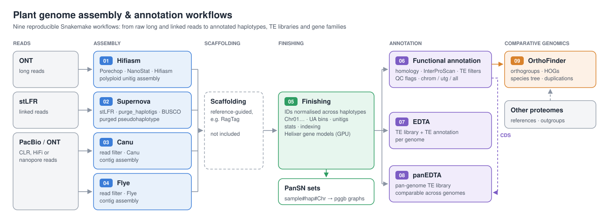

# Plant genome assembly and annotation workflows

Reproducible [Snakemake](https://snakemake.readthedocs.io) workflows for
assembling and annotating complex, heterozygous and polyploid plant genomes
from long and linked reads.



There are nine independent workflows. Each assembler has its own workflow,
the three long-read assemblers share one evaluation module so their results
can be compared directly, and the annotation workflows run on any of the
resulting assemblies.

| # | Workflow | Input | Main tools | Output | Help |
|---|---|---|---|---|---|
| 01 | Assembly: Hifiasm | ONT reads | Porechop, seqtk, NanoStat, Hifiasm | Polyploid unitig assembly | [README](workflows/01_assembly_hifiasm_ont/README.md) |
| 02 | Assembly: Supernova | stLFR linked reads | stlfr2supernova, Supernova, minimap2, purge_haplotigs, BUSCO | Purged pseudohaplotype assembly | [README](workflows/02_assembly_supernova_stlfr/README.md) |
| 03 | Assembly: Canu | PacBio / ONT reads | SeqKit, Canu | Contig assembly | [README](workflows/03_assembly_canu/README.md) |
| 04 | Assembly: Flye | PacBio / ONT reads | SeqKit, Flye | Contig assembly | [README](workflows/04_assembly_flye/README.md) |
| 05 | Finishing + gene prediction | Scaffolded haplotypes | Python, samtools, BBMap, Helixer | Consistently named haplotypes, PanSN sets for pggb, gene models | [README](workflows/05_finishing_helixer/README.md) |
| 06 | Functional annotation | Genome + Helixer GFF3 | AGAT, gffread, MMseqs2 / DIAMOND / BLASTP, InterProScan, compleasm | Annotated, TE-filtered gene sets + QC flags | [README](workflows/06_functional_annotation/README.md) |
| 07 | Repeat annotation | Genome FASTA | EDTA | TE library + TE annotation per genome | [README](workflows/07_repeats_edta/README.md) |
| 08 | Pan-genome repeat annotation | All genomes + CDS | panEDTA | Shared TE library, comparable annotations | [README](workflows/08_pan_repeats_panedta/README.md) |
| 09 | Gene families | Protein sets of all genomes / species | OrthoFinder | Orthogroups, HOGs, species tree, orthologues, duplications | [README](workflows/09_gene_families_orthofinder/README.md) |

Workflows 01, 03 and 04 evaluate every assembly with compleasm (gene-space
completeness) and BBMap `stats.sh` (contiguity); workflow 02 uses BUSCO.

Reference-guided scaffolding (for example with RagTag) sits between assembly
and finishing and is not part of these workflows.

---

## Repository layout

```
.
├── docs/                       overview graphic
├── config/                     one YAML per workflow: samples, paths, parameters
├── envs/                       Conda environment per tool group
├── profiles/slurm/             Snakemake profile for Slurm clusters
├── resources/                  small reference files (example TE Pfam list)
├── scripts/                    Python scripts called by workflows 05 and 06
│   └── lib/genome_utils.py     shared FASTA / GFF3 / InterProScan / compleasm helpers
├── workflows/
│   ├── common/assembly_eval.smk    evaluation shared by workflows 01, 03, 04
│   ├── 01_assembly_hifiasm_ont/    Snakefile + README
│   ├── 02_assembly_supernova_stlfr/
│   ├── 03_assembly_canu/
│   ├── 04_assembly_flye/
│   ├── 05_finishing_helixer/
│   ├── 06_functional_annotation/
│   ├── 07_repeats_edta/
│   ├── 08_pan_repeats_panedta/
│   └── 09_gene_families_orthofinder/
├── Dockerfile                  container with Snakemake and the Slurm executor
└── LICENSE
```

## Installation

```bash
git clone https://github.com/vsbonthala/plant-genome-assembly-annotation.git
cd plant-genome-assembly-annotation
mamba create -n snakemake -c conda-forge -c bioconda snakemake
mamba activate snakemake
```

Every tool runs in its own Conda environment from `envs/`, created
automatically on first use with `--use-conda`. A few tools are not on Conda
and need a separate installation:

| Tool | Used in | Notes |
|---|---|---|
| Supernova, stlfr2supernova_pipeline | 02 | 10x / BGI software; `supernova` on the `PATH` |
| Helixer | 05 | GPU; container or virtualenv, activated via `helixer.setup` |
| InterProScan | 06 | Path set in `interproscan.cmd` |

## Usage

Always run from the repository root. Edit the workflow's config first, check
the plan with a dry run, then run:

```bash
W=03_assembly_canu
snakemake -s workflows/$W/Snakefile --configfile config/$W.yaml -n          # dry run
snakemake -s workflows/$W/Snakefile --configfile config/$W.yaml --use-conda --cores 20
```

Results are written to `results/<workflow>/<sample>/`, with a log for every
step and benchmark files (run time, memory) for the main ones.

### On a Slurm cluster

```bash
pip install snakemake-executor-plugin-slurm
# set your account and partition in profiles/slurm/config.yaml
snakemake -s workflows/$W/Snakefile --configfile config/$W.yaml \
          --workflow-profile profiles/slurm
```

Each step is submitted as its own job with the threads and memory set in the
config, so samples and haplotypes run in parallel.

### With Docker

```bash
docker build -t plant-genome-workflows .
docker run --rm -v "$PWD":/work -w /work plant-genome-workflows \
    -s workflows/$W/Snakefile --configfile config/$W.yaml --use-conda --cores 8
```

## Typical run order

1. Assemble with one or more of workflows **01–04**; compare their `eval/`
   outputs.
2. Scaffold the chosen assembly against a reference (not included).
3. Run **05** for finished haplotypes, PanSN sets and Helixer gene models.
4. Run **06** for functional annotation and gene-set QC.
5. Run **07** for TE annotation of individual genomes, or **08** for a
   pan-genome TE library and comparable annotations across all genomes.
6. Run **09** on the final protein sets (plus any reference or outgroup
   proteomes) for gene families, orthologues and duplication events.

## Testing

Check every workflow without running any tools:

```bash
for W in $(ls workflows | grep -v common); do
  snakemake -s workflows/$W/Snakefile --configfile config/$W.yaml -n
done
```

Workflows 06–09 read the outputs of earlier workflows (05 or 06), so their dry runs need
those files (or edit the input paths in their configs).

## Author

Venkata Suresh Bonthala — [ORCID 0000-0001-6550-1648](https://orcid.org/0000-0001-6550-1648)

## License

MIT — see [LICENSE](LICENSE). Please cite the underlying tools when you use
these workflows.
